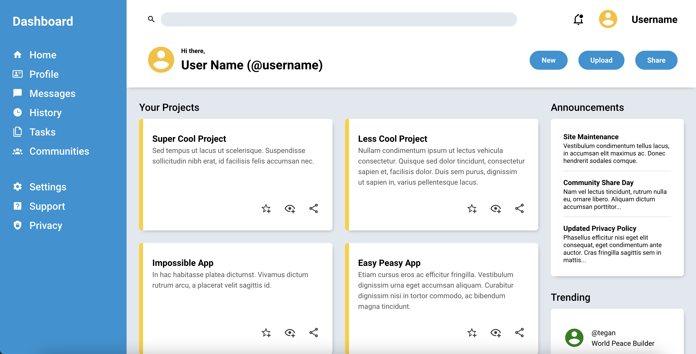

# Admin Dashboard Project – The Odin Project

## Description
This is an admin dashboard interface built as part of The Odin Project’s **Intermediate HTML and CSS** course.  
The dashboard simulates a panel for a community or forum-style application (similar to Discord or Reddit).  
The layout is primarily based on **CSS Grid**, with **Flexbox** used for certain components.

## Features
- Navigation sidebar  
- Header with search and post controls  
- Main content area displaying projects, announcements, and trending sections

## Tools Used
- HTML5  
- CSS3 (Grid, Flexbox, Variables, and Functions)

 

